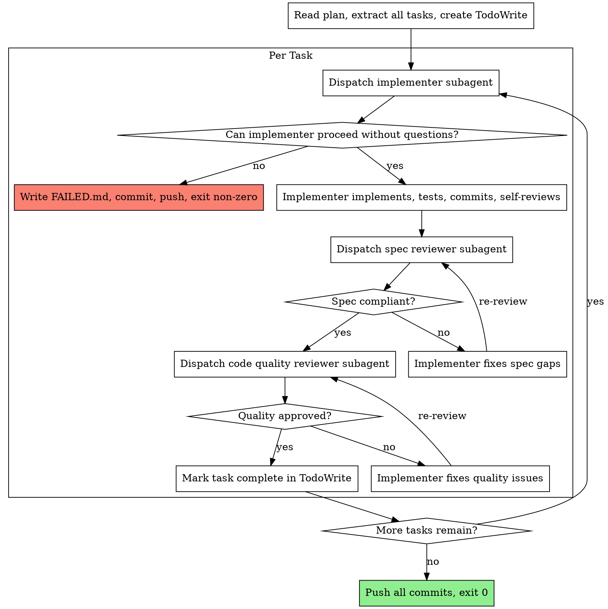

# Ephemeral Sandbox Implementation Plan

> **For Claude:** REQUIRED SUB-SKILL: Use superpowers:executing-plans to implement this plan task-by-task.

**Goal:** Build a headless-driven-development skill and Docker sandbox so agent implementation runs in an ephemeral container with full OS permissions, zero host blast radius, and a PR as the only output.

**Architecture:** A new `headless-driven-development` skill (variant of `subagent-driven-development`) removes all human interaction paths and replaces them with a FAILED.md contract. A Docker container clones the target repo, runs Claude Code with `--dangerously-skip-permissions` (safe inside the sandbox), executes the skill, and the host script creates the PR on success.

**Tech Stack:** Bash, Docker, Claude Code CLI, gh CLI, Node.js

---

### Task 1: Create the headless-driven-development skill directory

**Files:**
- Create: `skills/headless-driven-development/` (directory)

**Step 1: Create the directory**

```bash
mkdir -p skills/headless-driven-development
```

**Step 2: Verify**

```bash
ls skills/headless-driven-development
```
Expected: empty directory

**Step 3: Commit**

```bash
git add skills/headless-driven-development
git commit -m "feat: scaffold headless-driven-development skill directory"
```

---

### Task 2: Write SKILL.md for headless-driven-development

**Files:**
- Create: `skills/headless-driven-development/SKILL.md`

Reference: `skills/subagent-driven-development/SKILL.md` - this is the source we are adapting.

Key changes from the original:
1. Frontmatter name/description updated
2. "When to Use" updated - this is for headless/container contexts only
3. Process flow: remove the "Implementer subagent asks questions?" diamond entirely. If implementer cannot proceed → write FAILED.md → exit non-zero
4. After all tasks complete: commit, push, exit 0. Remove `finishing-a-development-branch` entirely (PR is created by the host script)
5. Add a "Headless Contract" section explaining the no-interaction guarantee
6. Add FAILED.md format spec
7. Update Red Flags section

**Step 1: Create SKILL.md**

```markdown
---
name: headless-driven-development
description: Use when executing implementation plans inside a headless container with no human present - zero interaction variant of subagent-driven-development
---

# Headless-Driven Development

Execute plan by dispatching fresh subagent per task inside a headless environment.
No human interaction. Any blocker → write FAILED.md → stop.

**Core principle:** Self-sufficient plan + fresh subagent per task + two-stage review = autonomous implementation

## Headless Contract

You are running inside an ephemeral Docker container. There is no human present.

- **Never** ask a question or wait for input
- **Never** call `finishing-a-development-branch` (PR is created externally)
- If you cannot proceed on a task: write FAILED.md to repo root, commit it, push, exit non-zero
- If all tasks complete: push all commits, exit 0

The plan must be self-sufficient. If it is not, FAILED.md is the feedback mechanism.

## FAILED.md Format

Write this file to the repo root when stopping early:

```markdown
## Failed at task: <task name and number>
## Reason: <specific reason - missing context, test failure, etc.>
## Last verification output:
<paste exact test/lint/command output>
## What is needed to proceed:
<specific missing information or clarification>
```

Commit and push FAILED.md before exiting non-zero.

## When to Use

This skill runs inside a Docker sandbox container only. Do not use in interactive sessions.
Use `subagent-driven-development` for interactive sessions with a human present.

## The Process



## Prompt Templates

- `./implementer-prompt.md` - Dispatch implementer subagent (headless variant)
- `./spec-reviewer-prompt.md` - Dispatch spec compliance reviewer
- `./code-quality-reviewer-prompt.md` - Dispatch code quality reviewer

## Completion

When all tasks are done:

```bash
git push origin HEAD
```

Then exit 0. Do not call `finishing-a-development-branch`. The host script handles PR creation.

## Red Flags

**Never:**
- Ask a question or pause for human input
- Call `finishing-a-development-branch`
- Create a PR (host script does this)
- Skip FAILED.md before exiting non-zero (it is the debugging artifact)
- Dispatch multiple implementation subagents in parallel (conflicts)
- Make subagent read plan file (provide full text instead)
- Skip spec compliance review before code quality review (wrong order)
- Accept "close enough" on spec compliance

**If implementer cannot proceed:**
- Write FAILED.md with specific reason and what is needed
- `git add FAILED.md && git commit -m "ci: implementation blocked - see FAILED.md"`
- `git push origin HEAD`
- Exit non-zero immediately

**If a task fails verification:**
- Implementer attempts one self-correction
- If still failing: write FAILED.md, commit, push, exit non-zero
- Do not retry indefinitely

## Integration

**Required before running:**
- Plan must be committed to the JIRA branch and self-sufficient
- Branch must exist on remote

**Subagents should use:**
- `superpowers:test-driven-development` - for each implementation task
```

**Step 2: Verify file exists**

```bash
ls -la skills/headless-driven-development/SKILL.md
```
Expected: file present

**Step 3: Commit**

```bash
git add skills/headless-driven-development/SKILL.md
git commit -m "feat: add headless-driven-development SKILL.md"
```

---

### Task 3: Write implementer-prompt.md (headless variant)

**Files:**
- Create: `skills/headless-driven-development/implementer-prompt.md`

Reference: `skills/subagent-driven-development/implementer-prompt.md`

Key changes:
1. Remove the "Before You Begin / Ask them now" section entirely
2. Replace with: "If you cannot proceed without clarification → write FAILED.md and stop"
3. Remove "While you work: If you encounter something unclear, ask questions" line
4. Add FAILED.md instructions to the report section

**Step 1: Create implementer-prompt.md**

```markdown
# Implementer Subagent Prompt Template (Headless)

Use this template when dispatching an implementer subagent inside the headless sandbox.

```
Task tool (general-purpose):
  description: "Implement Task N: [task name]"
  prompt: |
    You are implementing Task N: [task name] inside a headless Docker container.
    There is no human present. Do not ask questions.

    ## Task Description

    [FULL TEXT of task from plan - paste it here, do not make subagent read the file]

    ## Context

    [Scene-setting: where this fits, dependencies, architectural context]

    ## If You Cannot Proceed

    If the task description is missing information you need to implement it:

    1. Write FAILED.md to the repo root:
       ```
       ## Failed at task: N - [task name]
       ## Reason: [specific missing information]
       ## Last verification output: N/A
       ## What is needed to proceed: [exactly what is missing]
       ```
    2. `git add FAILED.md && git commit -m "ci: implementation blocked - see FAILED.md"`
    3. `git push origin HEAD`
    4. Stop and exit non-zero

    ## Your Job

    1. Implement exactly what the task specifies
    2. Write tests (follow TDD - red, green, refactor)
    3. Verify implementation works (run tests and lint)
    4. If verification fails after one self-correction attempt: write FAILED.md (see above) and stop
    5. Commit your work
    6. Self-review
    7. Report back

    Work from: [directory]

    ## Before Reporting Back: Self-Review

    Review your work with fresh eyes:

    **Completeness:**
    - Did I fully implement everything in the spec?
    - Are there edge cases I did not handle?

    **Quality:**
    - Is this my best work?
    - Are names clear and accurate?

    **Discipline:**
    - Did I avoid overbuilding (YAGNI)?
    - Did I follow existing patterns in the codebase?

    **Testing:**
    - Do tests verify actual behavior (not just mock behavior)?
    - Did I follow TDD?
    - Are tests comprehensive?

    Fix any issues found before reporting.

    ## Report Format

    When done:
    - What you implemented
    - Test results (exact output)
    - Files changed
    - Self-review findings (if any)
```
```

**Step 2: Verify**

```bash
ls -la skills/headless-driven-development/implementer-prompt.md
```

**Step 3: Commit**

```bash
git add skills/headless-driven-development/implementer-prompt.md
git commit -m "feat: add headless implementer prompt"
```

---

### Task 4: Copy spec and code quality reviewer prompts

**Files:**
- Create: `skills/headless-driven-development/spec-reviewer-prompt.md`
- Create: `skills/headless-driven-development/code-quality-reviewer-prompt.md`

These are identical to the originals - reviewers do not need human interaction.

**Step 1: Copy both files**

```bash
cp skills/subagent-driven-development/spec-reviewer-prompt.md \
   skills/headless-driven-development/spec-reviewer-prompt.md

cp skills/subagent-driven-development/code-quality-reviewer-prompt.md \
   skills/headless-driven-development/code-quality-reviewer-prompt.md
```

**Step 2: Verify**

```bash
ls skills/headless-driven-development/
```
Expected: 4 files - SKILL.md, implementer-prompt.md, spec-reviewer-prompt.md, code-quality-reviewer-prompt.md

**Step 3: Commit**

```bash
git add skills/headless-driven-development/
git commit -m "feat: complete headless-driven-development skill"
```

---

### Task 5: Create sandbox directory structure

**Files:**
- Create: `sandbox/` (directory)
- Create: `sandbox/.gitignore`
- Create: `sandbox/.env.example`

**Step 1: Create directory and gitignore**

```bash
mkdir -p sandbox
```

```bash
# sandbox/.gitignore
.env
logs/
```

**Step 2: Create .env.example**

```bash
# sandbox/.env.example
# Copy this to .env and fill in your values. Never commit .env.

# Your Anthropic API key (from console.anthropic.com or keychain)
ANTHROPIC_API_KEY=sk-ant-...

# GitHub classic PAT with repo scope
GITHUB_TOKEN=ghp_...
```

**Step 3: Verify**

```bash
ls sandbox/
```
Expected: `.gitignore`, `.env.example`

**Step 4: Commit**

```bash
git add sandbox/
git commit -m "feat: scaffold sandbox directory"
```

---

### Task 6: Write the Dockerfile

**Files:**
- Create: `sandbox/Dockerfile`

The image installs all OS-level dependencies. Secrets are never baked in - they are passed at runtime via environment variables.

**Step 1: Write Dockerfile**

```dockerfile
FROM node:20-bookworm-slim

# Install OS dependencies
RUN apt-get update && apt-get install -y \
    git \
    curl \
    python3 \
    python3-pip \
    ca-certificates \
    && rm -rf /var/lib/apt/lists/*

# Install gh CLI
RUN curl -fsSL https://cli.github.com/packages/githubcli-archive-keyring.gpg \
    | dd of=/usr/share/keyrings/githubcli-archive-keyring.gpg \
    && chmod go+r /usr/share/keyrings/githubcli-archive-keyring.gpg \
    && echo "deb [arch=$(dpkg --print-architecture) signed-by=/usr/share/keyrings/githubcli-archive-keyring.gpg] https://cli.github.com/packages stable main" \
    | tee /etc/apt/sources.list.d/github-cli.list > /dev/null \
    && apt-get update && apt-get install -y gh \
    && rm -rf /var/lib/apt/lists/*

# Install Claude Code CLI
RUN npm install -g @anthropic-ai/claude-code

# Configure git identity (required for commits inside container)
RUN git config --global user.email "agent@sandbox.local" \
    && git config --global user.name "Sandbox Agent"

# Working directory for repo clone
WORKDIR /workspace

# Copy entrypoint script
COPY entrypoint.sh /entrypoint.sh
RUN chmod +x /entrypoint.sh

# Mount point for superpowers plugin (volume mounted at runtime)
RUN mkdir -p /superpowers

ENTRYPOINT ["/entrypoint.sh"]
```

**Step 2: Verify Dockerfile exists**

```bash
ls -la sandbox/Dockerfile
```

**Step 3: Commit**

```bash
git add sandbox/Dockerfile
git commit -m "feat: add sandbox Dockerfile"
```

---

### Task 7: Write the container entrypoint script

**Files:**
- Create: `sandbox/entrypoint.sh`

This script runs inside the container. It clones the repo, checks out the branch, configures Claude Code to use the mounted superpowers plugin, then runs the headless skill.

**Step 1: Write entrypoint.sh**

```bash
#!/usr/bin/env bash
set -euo pipefail

LOG_FILE="/logs/${JIRA_BRANCH}-$(date +%Y%m%dT%H%M%S).log"
exec > >(tee -a "$LOG_FILE") 2>&1

echo "[sandbox] Starting at $(date)"
echo "[sandbox] Repo: $REPO_URL"
echo "[sandbox] Branch: $JIRA_BRANCH"
echo "[sandbox] Plan: $PLAN_PATH"

# Configure gh CLI with token
echo "$GITHUB_TOKEN" | gh auth login --with-token

# Configure git to use token for HTTPS
git config --global credential.helper '!f() { echo "username=x-token"; echo "password=$GITHUB_TOKEN"; }; f'

# Clone and checkout
echo "[sandbox] Cloning repo..."
git clone "$REPO_URL" /workspace/repo
cd /workspace/repo
git checkout "$JIRA_BRANCH"
echo "[sandbox] On branch: $(git branch --show-current)"

# Configure Claude Code to use mounted superpowers plugin
mkdir -p /root/.claude
cat > /root/.claude/settings.json <<EOF
{
  "enabledPlugins": {
    "superpowers@local": true
  },
  "extraKnownMarketplaces": {
    "local": {
      "source": {
        "source": "directory",
        "path": "/superpowers"
      }
    }
  }
}
EOF

echo "[sandbox] Starting Claude Code..."
claude --dangerously-skip-permissions -p \
  "Use superpowers:headless-driven-development to implement the plan at $PLAN_PATH"
EXIT_CODE=$?

echo "[sandbox] Claude exited with code: $EXIT_CODE"
exit $EXIT_CODE
```

**Step 2: Verify**

```bash
ls -la sandbox/entrypoint.sh
```

**Step 3: Commit**

```bash
git add sandbox/entrypoint.sh
git commit -m "feat: add container entrypoint script"
```

---

### Task 8: Write the host orchestration script

**Files:**
- Create: `sandbox/run-sandbox.sh`

This script runs on the host. It builds the image, runs the container, reads the exit code, creates the PR on success, and cleans up.

**Step 1: Write run-sandbox.sh**

```bash
#!/usr/bin/env bash
set -euo pipefail

# Usage: ./run-sandbox.sh <repo-url> <jira-branch> <plan-path>
# Example: ./run-sandbox.sh https://github.com/lendesk/finmo-app FINMO-1234 docs/plans/2026-04-24-my-feature.md

REPO_URL="${1:?Usage: $0 <repo-url> <jira-branch> <plan-path>}"
JIRA_BRANCH="${2:?Usage: $0 <repo-url> <jira-branch> <plan-path>}"
PLAN_PATH="${3:?Usage: $0 <repo-url> <jira-branch> <plan-path>}"

SCRIPT_DIR="$(cd "$(dirname "${BASH_SOURCE[0]}")" && pwd)"
ENV_FILE="$SCRIPT_DIR/.env"
SUPERPOWERS_DIR="$(cd "$SCRIPT_DIR/.." && pwd)"
LOGS_DIR="$SCRIPT_DIR/logs"
IMAGE_NAME="finmo-sandbox"

# Validate .env exists
if [[ ! -f "$ENV_FILE" ]]; then
  echo "[host] ERROR: $ENV_FILE not found. Copy .env.example to .env and fill in values."
  exit 1
fi

mkdir -p "$LOGS_DIR"

echo "[host] Building sandbox image..."
docker build -t "$IMAGE_NAME" "$SCRIPT_DIR"

echo "[host] Running sandbox container..."
echo "[host] Repo:   $REPO_URL"
echo "[host] Branch: $JIRA_BRANCH"
echo "[host] Plan:   $PLAN_PATH"

CONTAINER_ID=$(docker run -d \
  --env-file "$ENV_FILE" \
  --env REPO_URL="$REPO_URL" \
  --env JIRA_BRANCH="$JIRA_BRANCH" \
  --env PLAN_PATH="$PLAN_PATH" \
  --volume "$LOGS_DIR:/logs" \
  --volume "$SUPERPOWERS_DIR:/superpowers:ro" \
  "$IMAGE_NAME")

echo "[host] Container started: $CONTAINER_ID"
echo "[host] Streaming logs..."
docker logs -f "$CONTAINER_ID" &
LOGS_PID=$!

# Wait for container to finish
docker wait "$CONTAINER_ID"
EXIT_CODE=$(docker inspect "$CONTAINER_ID" --format='{{.State.ExitCode}}')
kill $LOGS_PID 2>/dev/null || true

echo ""
echo "[host] Container exited with code: $EXIT_CODE"

if [[ "$EXIT_CODE" == "0" ]]; then
  echo "[host] Implementation succeeded. Creating PR..."
  PR_URL=$(gh pr create \
    --repo "$(basename $REPO_URL .git)" \
    --base main \
    --head "$JIRA_BRANCH" \
    --title "$JIRA_BRANCH: implementation" \
    --body "Automated implementation via sandbox agent.")
  echo "[host] PR created: $PR_URL"
else
  LOG_FILE=$(ls -t "$LOGS_DIR"/${JIRA_BRANCH}-*.log 2>/dev/null | head -1 || echo "no log found")
  echo "[host] Implementation FAILED."
  echo "[host] Log: $LOG_FILE"
  echo "[host] Check FAILED.md on the $JIRA_BRANCH branch for details."
fi

echo "[host] Cleaning up container..."
docker rm "$CONTAINER_ID" > /dev/null

echo "[host] Done."
exit "$EXIT_CODE"
```

**Step 2: Make executable**

```bash
chmod +x sandbox/run-sandbox.sh
```

**Step 3: Verify**

```bash
ls -la sandbox/run-sandbox.sh
```

**Step 4: Commit**

```bash
git add sandbox/run-sandbox.sh
git commit -m "feat: add host orchestration script"
```

---

### Task 9: Smoke test the Dockerfile builds cleanly

**Step 1: Build the image**

```bash
cd sandbox && docker build -t finmo-sandbox .
```
Expected: `Successfully built ...` with no errors

**Step 2: Verify claude and gh are installed**

```bash
docker run --rm finmo-sandbox sh -c "claude --version && gh --version && git --version && node --version"
```
Expected: version strings for all four tools, no errors

**Step 3: Commit nothing** - this is a verification only step

---

### Task 10: Verify the skill is registered correctly

**Step 1: List skill files**

```bash
ls skills/headless-driven-development/
```
Expected: `SKILL.md  code-quality-reviewer-prompt.md  implementer-prompt.md  spec-reviewer-prompt.md`

**Step 2: Check frontmatter**

```bash
head -6 skills/headless-driven-development/SKILL.md
```
Expected:
```
---
name: headless-driven-development
description: Use when executing implementation plans inside a headless container with no human present - zero interaction variant of subagent-driven-development
---
```

**Step 3: Final commit if anything is outstanding**

```bash
git status
```
Expected: clean working tree. If not, commit outstanding files.
