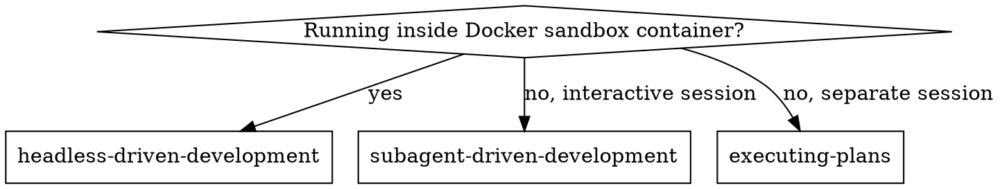

# Headless Plans Structure Implementation Plan

> **For Claude:** REQUIRED SUB-SKILL: Use superpowers:headless-driven-development (container) or superpowers:subagent-driven-development (interactive) to implement this plan task-by-task.

**Goal:** Replace `docs/plans/` with `.headless-plans/design/` + `.headless-plans/implementation/` throughout the plugin, and add multi-repo context awareness to brainstorming and writing-plans skills.

**Architecture:** Four skill files and one script file need targeted edits. Existing plan files get migrated. No new files are created beyond the directory restructure. Style consistency fixes are applied to headless-driven-development as a bonus pass.

**Tech Stack:** Bash, Markdown

---

### Task 1: Migrate existing plan files to .headless-plans/

**Files:**
- Create: `.headless-plans/design/`
- Create: `.headless-plans/implementation/`
- Move: `docs/plans/2026-04-24-ephemeral-sandbox-design.md` → `.headless-plans/design/`
- Move: `docs/plans/2026-04-24-ephemeral-sandbox.md` → `.headless-plans/implementation/`

**Step 1: Create new directory structure and move files**

```bash
cd /Users/rezagholizadeh/Documents/Workspaces/superpowers-for-lendesk
mkdir -p .headless-plans/design .headless-plans/implementation
git mv docs/plans/2026-04-24-ephemeral-sandbox-design.md .headless-plans/design/
git mv docs/plans/2026-04-24-ephemeral-sandbox.md .headless-plans/implementation/
rmdir docs/plans
```

**Step 2: Verify**

```bash
ls .headless-plans/design/ .headless-plans/implementation/
```
Expected:
```
.headless-plans/design/:
2026-04-24-ephemeral-sandbox-design.md

.headless-plans/implementation/:
2026-04-24-ephemeral-sandbox.md
```

**Step 3: Commit**

```bash
git add -A
git commit -m "refactor: migrate plan files from docs/plans/ to .headless-plans/"
```

---

### Task 2: Update brainstorming SKILL.md - paths and multi-repo awareness

**Files:**
- Modify: `skills/brainstorming/SKILL.md`

Reference: `skills/subagent-driven-development/SKILL.md` for style consistency.

**Step 1: Update checklist item 5 path**

Find:
```
5. **Write design doc** — save to `docs/plans/YYYY-MM-DD-<topic>-design.md` and commit
```

Replace with:
```
5. **Write design doc** — save to `.headless-plans/design/YYYY-MM-DD-<topic>-design.md`, detect context (see After the Design), commit
```

**Step 2: Replace the entire "After the Design" section**

Find the block starting with `## After the Design` and ending before `## Key Principles`, and replace it with:

```markdown
## After the Design

**Context detection:**

```bash
git rev-parse --git-dir 2>/dev/null  # outputs .git if inside a repo; empty if at workspace root
```

**Single-repo context** (`.git` exists in current directory):
- Write design doc to `.headless-plans/design/YYYY-MM-DD-<topic>-design.md`
- Use elements-of-style:writing-clearly-and-concisely skill if available
- Commit to current branch (do not create JIRA branch yet — writing-plans does that)

**Workspace context** (no `.git` in current directory, subdirs are repos):
- Write design doc to `.headless-plans/design/YYYY-MM-DD-<topic>-design.md` at workspace root
- Identify which repos are involved — use the brainstorming conversation context, do not ask
- The design doc will be distributed to each involved repo by writing-plans in the next step

**Implementation:**
- Invoke the writing-plans skill to create a detailed implementation plan
- Do NOT invoke any other skill. writing-plans is the next step.
```

**Step 3: Verify the file looks correct**

```bash
grep -n "headless-plans\|docs/plans\|After the Design\|Context detection" \
  skills/brainstorming/SKILL.md
```
Expected: all references show `.headless-plans`, no remaining `docs/plans` references.

**Step 4: Commit**

```bash
git add skills/brainstorming/SKILL.md
git commit -m "feat: update brainstorming skill to use .headless-plans/ and add context detection"
```

---

### Task 3: Update writing-plans SKILL.md - paths, multi-repo, JIRA branch

**Files:**
- Modify: `skills/writing-plans/SKILL.md`

**Step 1: Update "Save plans to" line**

Find:
```
**Save plans to:** `docs/plans/YYYY-MM-DD-<feature-name>.md`
```
Replace with:
```
**Save plans to:** `.headless-plans/implementation/YYYY-MM-DD-<feature-name>.md` (see Context Detection below)
```

**Step 2: Update the plan document header**

Find:
```
> **For Claude:** REQUIRED SUB-SKILL: Use superpowers:executing-plans to implement this plan task-by-task.
```
Replace with:
```
> **For Claude:** REQUIRED SUB-SKILL: Use superpowers:headless-driven-development (container) or superpowers:subagent-driven-development (interactive) to implement this plan task-by-task.
```

**Step 3: Add "Context Detection" section**

Insert this entire section after the `## Remember` section and before `## Execution Handoff`:

```markdown
## Context Detection

Before writing the plan, detect your context:

```bash
git rev-parse --git-dir 2>/dev/null  # outputs .git if inside a repo; empty if at workspace root
```

**Single-repo context** (`.git` exists in current directory):

1. Write plan to `.headless-plans/implementation/YYYY-MM-DD-<feature-name>.md`
2. Create and publish the JIRA branch:
   ```bash
   git checkout -b <JIRA-KEY>
   mkdir -p .headless-plans/design .headless-plans/implementation
   # copy design doc from brainstorming if it exists at workspace level
   git add .headless-plans/
   git commit -m "planning: add implementation plan for <JIRA-KEY>"
   git push -u origin <JIRA-KEY>
   ```

**Workspace context** (no `.git` in current directory, subdirs are repos):

Identify which repos are involved from the brainstorming conversation — do not ask.

For each involved repo:

1. Write a self-sufficient plan to `<repo>/.headless-plans/implementation/YYYY-MM-DD-<feature-name>.md`
   - Each plan covers only that repo — zero cross-repo references
   - The implementer for that repo will never see the other repos' plans
2. Copy the design doc from the workspace `.headless-plans/design/` into the repo:
   ```bash
   mkdir -p <repo>/.headless-plans/design <repo>/.headless-plans/implementation
   cp .headless-plans/design/*.md <repo>/.headless-plans/design/
   ```
3. Create and publish the JIRA branch in that repo:
   ```bash
   git -C <repo> checkout -b <JIRA-KEY>
   git -C <repo> add .headless-plans/
   git -C <repo> commit -m "planning: add implementation plan for <JIRA-KEY>"
   git -C <repo> push -u origin <JIRA-KEY>
   ```

Repeat for every involved repo. Each ends up with its own JIRA branch containing both the design doc and its self-sufficient implementation plan.
```

**Step 4: Update Execution Handoff path reference**

Find:
```
**"Plan complete and saved to `docs/plans/<filename>.md`. Two execution options:**
```
Replace with:
```
**"Plan complete and saved to `.headless-plans/implementation/<filename>.md` in each involved repo (branch: `<JIRA-KEY>`). Two execution options:**
```

**Step 5: Verify no remaining docs/plans references**

```bash
grep -n "docs/plans" skills/writing-plans/SKILL.md
```
Expected: no output.

**Step 6: Commit**

```bash
git add skills/writing-plans/SKILL.md
git commit -m "feat: update writing-plans skill to use .headless-plans/ with multi-repo context detection"
```

---

### Task 4: Style consistency pass on headless-driven-development SKILL.md

**Files:**
- Modify: `skills/headless-driven-development/SKILL.md`

Reference style: `skills/subagent-driven-development/SKILL.md`

The gap: "When to Use" in the original has a dot graph. Ours has plain text. Fix that, and add a brief "Advantages" section mirroring the original's structure.

**Step 1: Replace the "When to Use" section**

Find:
```markdown
## When to Use

This skill runs inside a Docker sandbox container only. Do not use in interactive sessions.
Use `subagent-driven-development` for interactive sessions with a human present.
```

Replace with:
```markdown
## When to Use



**vs. subagent-driven-development:**
- No human present — never pauses for questions or approval
- FAILED.md replaces all human interaction paths
- PR creation handled externally by host script
- `--dangerously-skip-permissions` safe because container is isolated
```

**Step 2: Add "Advantages" section after "Prompt Templates"**

After the `## Prompt Templates` section and before `## Completion`, insert:

```markdown
## Advantages

**vs. subagent-driven-development:**
- Full OS permissions inside container — no permission prompts
- Zero host blast radius — container is destroyed after run
- Reproducible — fresh environment every run
- Auditable — timestamped log file survives container teardown
- FAILED.md gives precise, actionable failure diagnostics

**Quality gates (same as subagent-driven-development):**
- Fresh subagent per task (no context pollution)
- Two-stage review: spec compliance first, then code quality
- Review loops ensure fixes actually work
```

**Step 3: Verify no docs/plans references**

```bash
grep -n "docs/plans" skills/headless-driven-development/SKILL.md
```
Expected: no output.

**Step 4: Commit**

```bash
git add skills/headless-driven-development/SKILL.md
git commit -m "feat: style consistency pass on headless-driven-development skill"
```

---

### Task 5: Update sandbox/run-sandbox.sh usage comment

**Files:**
- Modify: `sandbox/run-sandbox.sh`

**Step 1: Update the example path in the usage comment**

Find:
```bash
# Example: ./run-sandbox.sh https://github.com/lendesk/finmo-app FINMO-1234 docs/plans/2026-04-24-my-feature.md
```
Replace with:
```bash
# Example: ./run-sandbox.sh https://github.com/lendesk/finmo-app FINMO-1234 .headless-plans/implementation/2026-04-24-my-feature.md
```

**Step 2: Verify**

```bash
grep "headless-plans\|docs/plans" sandbox/run-sandbox.sh
```
Expected: one line showing `.headless-plans/implementation/`.

**Step 3: Commit and push**

```bash
git add sandbox/run-sandbox.sh
git commit -m "fix: update run-sandbox.sh usage example to use .headless-plans/"
git push origin main
```

---

### Task 6: Verify no remaining docs/plans references anywhere

**Step 1: Global search**

```bash
cd /Users/rezagholizadeh/Documents/Workspaces/superpowers-for-lendesk
grep -rn "docs/plans" skills/ sandbox/ .headless-plans/ 2>/dev/null
```
Expected: no output.

**Step 2: Verify .headless-plans/ structure**

```bash
find .headless-plans/ -type f | sort
```
Expected:
```
.headless-plans/design/2026-04-24-ephemeral-sandbox-design.md
.headless-plans/implementation/2026-04-24-ephemeral-sandbox.md
```

**Step 3: Final push if anything outstanding**

```bash
git status
```
Expected: clean. If not, commit and push outstanding changes.
