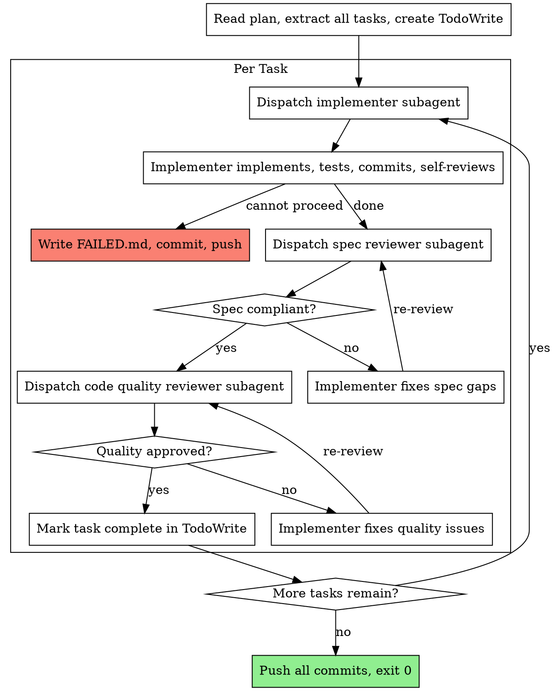

# Headless-Driven Development

Execute plan by dispatching fresh subagent per task inside a headless environment.
No human interaction. Any blocker → write FAILED.md → stop.

**Core principle:** Self-sufficient plan + fresh subagent per task + two-stage review = autonomous implementation

## Headless Contract

You are running inside an ephemeral Docker container. There is no human present.

- **Never** ask a question or wait for input
- **Never** call `finishing-a-development-branch` (PR is created externally)
- If you cannot proceed on a task: write FAILED.md to repo root, commit it, push. The container will detect FAILED.md and exit non-zero.
- If all tasks complete: push all commits, exit 0

The plan must be self-sufficient. If it is not, FAILED.md is the feedback mechanism.

## FAILED.md Format

Write this file to the repo root when stopping early:

```markdown
## Failed at task: <task name and number>
## Reason: <specific reason - missing context, test failure, etc.>
## Last verification output:
<paste exact test/lint/command output>
## What is needed to proceed:
<specific missing information or clarification>
```

After writing the file:
```bash
git add FAILED.md && git commit -m "ci: implementation blocked - see FAILED.md"
git push origin HEAD
```
Stop. The container detects FAILED.md on the branch.

## When to Use

This skill runs inside a Docker sandbox container only. Do not use in interactive sessions.
Use `subagent-driven-development` for interactive sessions with a human present.

## The Process



## Prompt Templates

- `./implementer-prompt.md` - Dispatch implementer subagent (headless variant)
- `./spec-reviewer-prompt.md` - Dispatch spec compliance reviewer
- `./code-quality-reviewer-prompt.md` - Dispatch code quality reviewer

## Completion

When all tasks are done:

```bash
git push origin HEAD
```

Then stop. The absence of FAILED.md signals success to the container. Do not call `finishing-a-development-branch`. The host script handles PR creation.

## Red Flags

**Never:**
- Ask a question or pause for human input
- Call `finishing-a-development-branch`
- Create a PR (host script does this)
- Skip writing FAILED.md before stopping (it is the signal the container uses to detect failure and the primary debugging artifact)
- Dispatch multiple implementation subagents in parallel (conflicts)
- Make subagent read plan file (provide full text instead)
- Skip spec compliance review before code quality review (wrong order)
- Accept "close enough" on spec compliance

**If implementer cannot proceed:**
- Write FAILED.md with specific reason and what is needed
- `git add FAILED.md && git commit -m "ci: implementation blocked - see FAILED.md"`
- `git push origin HEAD`
- Stop. The container detects FAILED.md on the branch and handles the non-zero exit.

**If mid-task verification fails (tests, lint):**
- Implementer attempts one self-correction
- If still failing after one attempt: write FAILED.md, commit, push, stop. The container detects FAILED.md.
- Note: this cap applies to test/lint failures only, not to spec or quality review cycles (those loop until approved).

## Integration

**Required before running:**
- Plan must be committed to the JIRA branch and self-sufficient
- Branch must exist on remote

**Subagents should use:**
- `superpowers:test-driven-development` - for each implementation task
